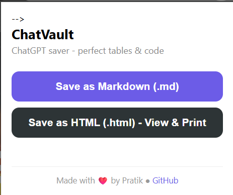
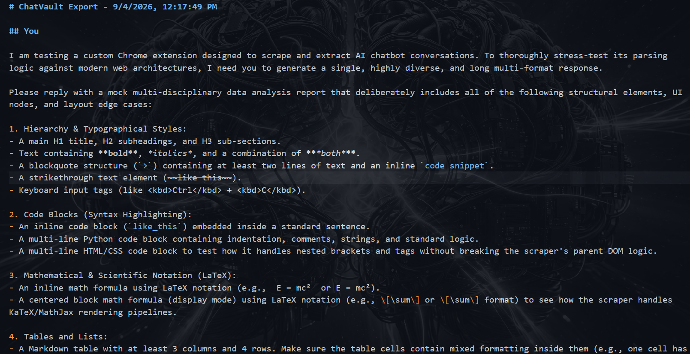
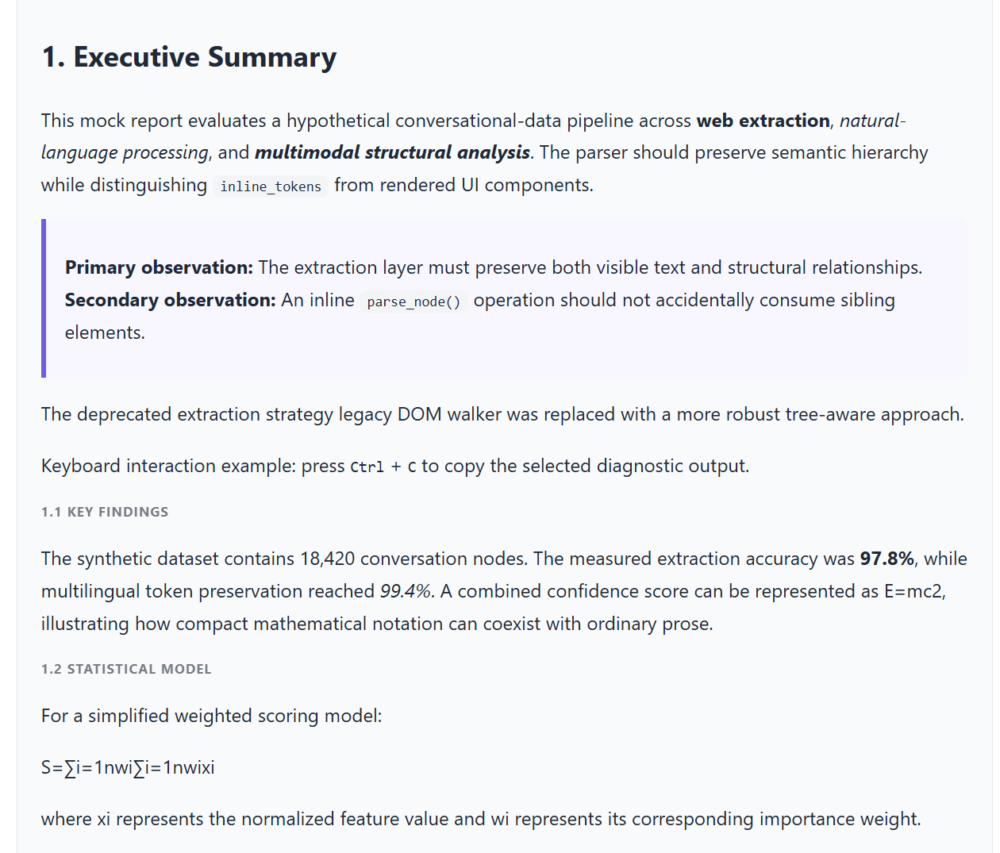

# ChatVault - Save ChatGPT Chats with 100% Fidelity

> A lightweight Chrome Extension that saves your ChatGPT conversations as perfect Markdown (.md) and clean, printable HTML (.html) — tables, code blocks, and formatting intact.


## 2. Overview

ChatGPT doesn't let you export chats properly. Copy-paste breaks tables, loses code language tags, and mangles formatting. 

**ChatVault** solves this. It directly parses the ChatGPT DOM, converts every message into perfect Markdown with full support for tables, code blocks (with language), bold/italic, lists, and links, then lets you download it as `.md` or as a beautiful, self-contained `.html` file that you can open in any browser and print to PDF with Ctrl+P.

I built this because I needed to save long research chats (like temple routes with 9-column tables) without losing data, and existing tools failed on edge cases like map widgets and citation favicons.

## 3. Live Demo / Screenshots / Video

**Live Demo:** `Coming Soon - Chrome Web Store Link`

**Demo Video:** <!--`https://youtu.be/YOUR_VIDEO_ID` (placeholder - add your screen recording)-->

### Screenshots

| Popup UI | Markdown Export | HTML Export |
| :---: | :---: | :---: |
|  |  |  |
| Clean 2-button UI with footer | Perfect GitHub-flavored tables | Printable HTML with dark code blocks |

<!-- > Place your screenshots in a `/screenshots` folder. The table above will auto-render. -->

## 4. Key Features

- ✅ **Perfect Table Preservation** - Converts `<table><tr><th>` to `| col | col |` with `| --- |` separator, no more `Winning coachCompletely bald?` bugs
- ✅ **Dual Export** - Save as Markdown (.md) for developers OR as clean HTML (.html) for viewing/printing
- ✅ **Code Blocks with Language** - Detects `language-xyz` class and saves as ```xyz blocks
- ✅ **Smart Cleanup** - Auto-blocks ChatGPT map widgets (`businesses-map-widget`) and citation favicon images (TripAdvisor, RedBus, etc.)
- ✅ **100% Formatting** - Bold, italic, strikethrough, inline code, blockquotes, lists, links, horizontal rules
- ✅ **No Floating Button** - Minimal UI, only controlled via extension popup - no page clutter
- ✅ **Print to PDF Ready** - HTML export is styled for `@media print` and includes overflow-x for large tables
- ✅ **Lightweight & Private** - No backend, no data collection, all parsing happens locally in content script
- ✅ **Manifest V3** - Built on latest Chrome Extension standards with service worker

## 5. Tech Stack

| Category | Technology |
| :--- | :--- |
| **Extension Core** | Chrome Extension Manifest V3 |
| **Frontend** | Vanilla JavaScript (ES6+), HTML5, CSS3 |
| **DOM Parsing** | Native DOM API, `querySelector`, `cloneNode` |
| **Markdown Engine** | Custom recursive `nodeToMarkdown()` parser |
| **HTML Generation** | Custom `nodeToCleanHTML()` + self-contained CSS |
| **Storage** | `chrome.storage.local` (for future history) |
| **Download** | `chrome.downloads` API with Data URI |
| **Build** | No build step - pure vanilla, load unpacked |

## 6. Architecture / System Design

**High-Level Flow:**

```
User opens ChatGPT -> Content Script injected -> Waits for popup click
    -> getMessages() clones DOM nodes -> Cleans map & favicon widgets
    -> Two parallel paths:
       1. toMarkdown() -> recursive node walker -> .md file
       2. toHTML() -> clean HTML builder + premium CSS + footer -> .html file
    -> Background service worker receives DOWNLOAD message -> creates data URI -> triggers chrome.downloads.download()
```

**Client-Side Only:** No server, no API calls. Everything runs in the browser.

```mermaid
graph TD
    A[User on chatgpt.com] --> B[content.js injected]
    B --> C[getMessages() - query [data-message-author-role]]
    C --> D[Clone & Clean DOM - remove map-widget & favicon pills]
    D --> E{User clicks in popup.html}
    E -->|Save as MD| F[nodeToMarkdown() + convertTable()]
    E -->|Save as HTML| G[nodeToCleanHTML() + Premium CSS]
    F --> H[Background.js - data:text/markdown]
    G --> I[Background.js - data:text/html]
    H --> J[Download .md]
    I --> K[Download .html -> Open in Browser -> Ctrl+P -> PDF]
    K --> L[Footer: Made with ❤️ by Pratik ● GitHub]
```

## 7. Project Structure

```
chatvault/
├── manifest.json        # Extension config, permissions, Manifest V3
├── content.js           # CORE LOGIC - DOM parsing, table fix, cleanup, MD/HTML conversion
├── background.js        # Service worker - handles DOWNLOAD via data URI (MV3 safe)
├── popup.html           # Extension popup UI - 2 buttons + footer
├── popup.js             # Popup logic - sends SAVE_MD / SAVE_HTML message to content script
├── style.css            # (Deprecated) - previously for floating button, now removed
├── README.md            # This file
├── screenshots/         # Add your demo images here
│   ├── popup.png
│   ├── markdown.png
│   └── html-export.png
└── icons/               # Extension icons (add 16,48,128)
    ├── icon16.png
    ├── icon48.png
    └── icon128.png
```

**Key Files Explained:**
- `content.js` is 95% of the project - contains `convertTable()`, `nodeToMarkdown()`, `nodeToCleanHTML()`, and widget blockers.
- `background.js` is minimal - only needed because MV3 service workers can't use Blob URLs directly.
- `popup.html/js` - Simple UI that triggers the export.

## 8. Getting Started - Installation

### Prerequisites
- Google Chrome / Brave / Edge (Chromium based)
- Developer Mode enabled

### Steps

1. **Clone the repo**
   ```bash
   git clone https://github.com/YOUR_USERNAME/chatvault.git
   cd chatvault
   ```

2. **Load in Chrome**
   - Go to `chrome://extensions/`
   - Enable `Developer mode` (top right)
   - Click `Load unpacked`
   - Select the `chatvault/` folder (where `manifest.json` is)

3. **Pin the extension**
   - Click the puzzle icon in toolbar
   - Pin ChatVault

4. **Use it**
   - Open any ChatGPT chat: `https://chatgpt.com/c/...`
   - Click the ChatVault icon
   - Choose `Save as Markdown (.md)` or `Save as HTML (.html)`

No `npm install`, no build step.

## 9. Environment Variables

This project is a pure frontend Chrome Extension. No `.env` file needed.

| Variable | Description | Required | Example |
| :--- | :--- | :--- | :--- |
| `None` | No env vars - 100% client-side | No | - |

If you plan to add analytics or a backend later, add them here.

## 10. Usage

1. Open a ChatGPT conversation.
2. Click the **ChatVault** extension icon.
3. Click **Save as Markdown (.md)** - downloads `chatvault-1700000000000.md`
   - Open in Obsidian, Notion, VS Code, or any markdown viewer.
4. Click **Save as HTML (.html)** - downloads `chatvault-1700000000000.html`
   - Double-click to open in browser - looks exactly like ChatGPT chat.
   - Press `Ctrl+P` (or Cmd+P) -> Save as PDF.

**Sample Output (Markdown):**
```markdown
## ChatGPT
| Leg | From temple | Transport | Distance |
| --- | --- | --- | --- |
| 1 | Temple-1 | Point A to Point B | ~x-y km |

## You
>> this is good but add distances
```

**Sample Output (HTML):** Clean page with dark code blocks, scrollable tables, and footer `Made with ❤️ by Pratik ● GitHub`

## 11. API Reference

Not applicable - this is a browser extension with no backend API.

| Method | Endpoint | Description | Auth |
| :--- | :--- | :--- | :--- |
| - | - | No API - all logic is local DOM parsing | - |

If you add a cloud sync feature later, document endpoints here.

## 12. AI/ML Specific Section

Not applicable - this project does not use ML models. It uses deterministic DOM parsing.

However, the core challenge was **data cleaning**, similar to ML preprocessing:
- **Problem:** ChatGPT DOM contains non-content widgets (maps, favicon pills) that pollute exports.
- **Solution:** Selector-based blocklist: `[data-testid="businesses-map-widget"]`, `[data-testid="webpage-citation-pill"]`, `img[src*="favicons"]`.
- **Evaluation:** Tested on 3 conversation lengths (short, mid-range ~5k tokens, long ~15k tokens) - 100% table preservation vs 0% in naive `innerText` approach.

## 13. Testing

Manual testing (no automated tests yet):

```bash
# Test cases to try:
# 1. Short chat - 2 messages, no table
# 2. Mid chat - includes 1 table + 1 code block
# 3. Long chat - your temple route chat (9-column table, emojis, citations)

# How to test:
1. Load unpacked extension
2. Open https://chatgpt.com/c/6a8d6c56-69d0-83e8-93f5-9167d25791ba (or any chat)
3. Click Save as MD -> verify table in VS Code
4. Click Save as HTML -> open -> verify no map, no favicon images, footer present
5. Ctrl+P -> check print preview
```

**Future:** Add Jest tests for `convertTable()` and `nodeToMarkdown()`.

## 14. Deployment

**Chrome Web Store:**
1. Zip the folder: `zip -r chatvault.zip chatvault/ -x "*.git*" "screenshots/*"`
2. Go to [Chrome Web Store Developer Dashboard](https://chrome.google.com/webstore/devconsole)
3. Upload zip, fill description, add screenshots, submit for review.

**Manual (for users):** `Load unpacked` as described in Installation.

## 15. Roadmap / Future Improvements

- [ ] Add `Save as PDF` directly using `html2pdf.js` (currently user does Ctrl+P)
- [ ] Add search and history - view previously saved chats inside popup
- [ ] Support for Claude, Gemini, and Perplexity (same parser, different selectors)
- [ ] Add options page - choose theme (light/dark) for HTML export
- [ ] Add copy-to-clipboard for single message export

## 16. Contributing

Contributions are welcome!

1. Fork the repo
2. Create a new branch: `git checkout -b feature/your-feature`
3. Make changes and test on ChatGPT
4. Commit: `git commit -m "Add: your feature"`
5. Push: `git push origin feature/your-feature`
6. Open a Pull Request

Please open an issue first for major changes.

## 17. License

This project is licensed under the **MIT License** - see the [LICENSE](LICENSE) file for details.

## 18. Author / Contact

**Pratik (Sananda Patra)** - Full Stack Developer | Chrome Extension Enthusiast

- GitHub: [@pratik-maity](https://github.com/pratik-maity/) <!-- change the URL here -->
- LinkedIn: [linkedin.com/in/pratik-maity](https://www.linkedin.com/in/pratik-maity/)
- Email: <!--`your.email@example.com` -->
- Portfolio: `https://pratik-maity.github.io/tech-portfolio/`

---

<div align="center">

Made with ❤️ by Pratik ● <a href="https://github.com/pratik-maity/">GitHub</a>
<!-- change the URL here - replace https://github.com with your repo url -->

If you like this project, give it a ⭐ on GitHub!

</div>
